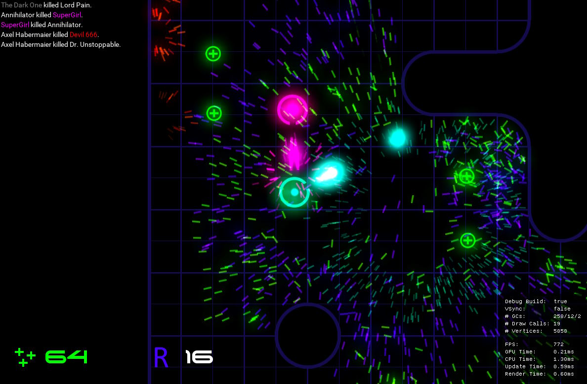
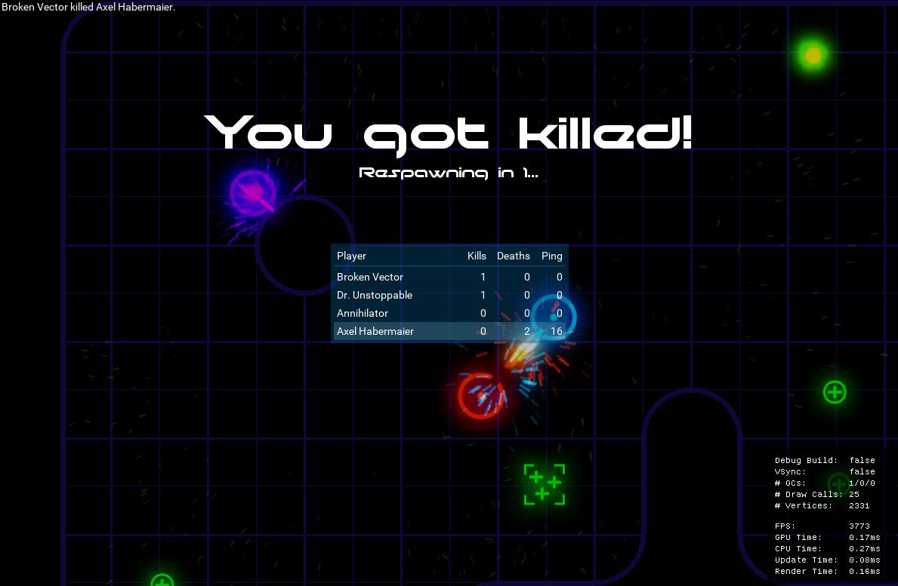
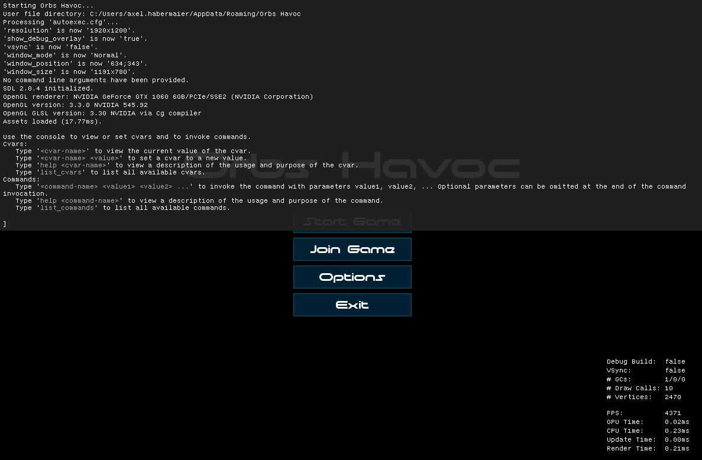

# Orbs Havoc

Orbs Havoc is a 2D shooting game with lots of particle effects.

Technologically, it is based on my other game [lwar](https://github.com/axel-habermaier/lwar), but without all the over-the-top infrastructure code that made lwar interesting but time-consuming to develop.
The tech stack is therefore just C#, OpenGL 3, GLSL, and lwar's UDP-based network protocol.

## In-Game Sreenshots

_Fighting scene with lots of particle effects._

_Waiting for respawn after being killed with score board being shown._

_Main menu with the game's in-game console being overlayed._
